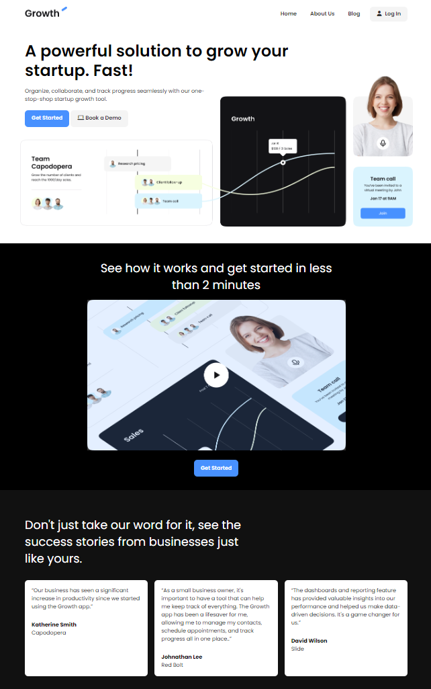

# 🌟 SaaS Landing Page  

## 🚀 Live Demo  
[🔗 **View the Website**](https://chipper-choux-54f45d.netlify.app/)  

---

## 🖥️ **Overview**  

This project is part of the **iCodeThis Challenge**, showcasing a **minimalist SaaS landing page** built with:  
- **HTML** for semantic structure.  
- **CSS** for responsive and visually appealing styling.  
- **JavaScript** for interactive functionality.  

The design prioritizes simplicity, functionality, and an exceptional user experience.  

---

## ✨ **Features**  

### 🔹 **HTML & CSS**  
- Semantic and clean HTML structure.  
- Responsive styling with no external frameworks.  

### 🔹 **JavaScript Interactivity**  
- Functional **hamburger menu** for navigation.  
- Dynamic **FAQ accordion** for better engagement.  

### 🔹 **User-Centric Design**  
- Focused on **accessibility** and smooth user interactions.  
- Lightweight and optimized for performance.  

---

## 📸 **Preview**  

<div align="center">  
    
</div>  

---

## 🛠️ **Technologies Used**  

- **HTML**  
- **CSS**  
- **JavaScript**  

---

## 📝 **Key Highlights**  

- **Minimalist Design**: Clean and clutter-free layout.  
- **Pure Codebase**: No external frameworks—built entirely with core web technologies.  
- **Future-Ready**: Easily scalable and adaptable.  

---

## 💡 **Getting Started**  

1. Clone the repository:  
   ```bash
   git clone https://github.com/yourusername/saas-landing-page.git
